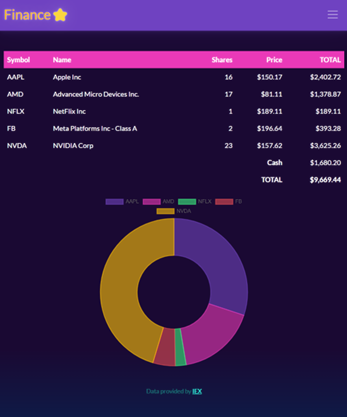

# Finance App

## Website demo
[https://www.spero61.click/](https://www.spero61.click/)

# 



    


### To Run Development Server
```bash
pip install -r requirements.txt
flask run
```


### Features
- Flask User Authentication
- Manage portfolios of US stocks via mock stock investment
- Realtime data fetch using [IEX Cloud API](https://iexcloud.io/)


